Final project report
================
Zhifeng Yang
11/6/2020

## Abstract

The project aimed to study the interaction of metabolic network between
multiple species.  
The steps to fulfill my goal:

1.  Simplify the individual network based on the method in reference
    paper (Borenstein, Kupiec et al. 2008).
2.  Produce a whole network of metabolism including all species
    (directed)
3.  map the network of each species into the whole metabolic network
4.  if two species have a lot of edges; for example, if one point to
    another a lot, one may be benefit to another, so there is an edge
    pointed to another from one. If one shares a lot of nodes point to
    them, they may compete for the resource of nodes, there should be a
    negative edge between them
5.  we can get a metabolic relation network of species.
6.  build a microbial interaction network using abundance correlation
7.  test if metabolic network has some prediction of the structure of
    microbial interaction network.

## Metabolic network

Network has been developed as a common method in microbial ecology
nowadays. Metabolic network, which describes how metabolites are
utilized and transformed inside or around cells, is the key to
interpreting the unique functions and traits of each species.

``` r
# download kgml file from KEGG site
# url=getKGMLurl("eco01100",organism ="eco")
# download.file(url, "xml/eco01100.xml")

## read the kgml file
mapfile <-  "xml/eco01100.xml"
map <- parseKGML(mapfile)
# map
# reactions <- getReactions(map)

## EXTRACT reaction graph
chemicalGraph <- KEGGpathway2reactionGraph(map)

# outDegrees <- sapply(edges(chemicalGraph), length)
# maxout <- names(sort(outDegrees,decreasing=TRUE))[1:3]

# nAttrs <- list()
# maxoutlabel <- as.list(maxout); names(maxoutlabel) <- maxout
# nAttrs$label <- makeAttr(chemicalGraph, "", maxoutlabel)
# nAttrs$fillcolor <- makeAttr(chemicalGraph, "lightblue", list(orange=maxout))
# nAttrs$width <- makeAttr(chemicalGraph,"0.8", list("1.8"=maxout))
plot(chemicalGraph)
```

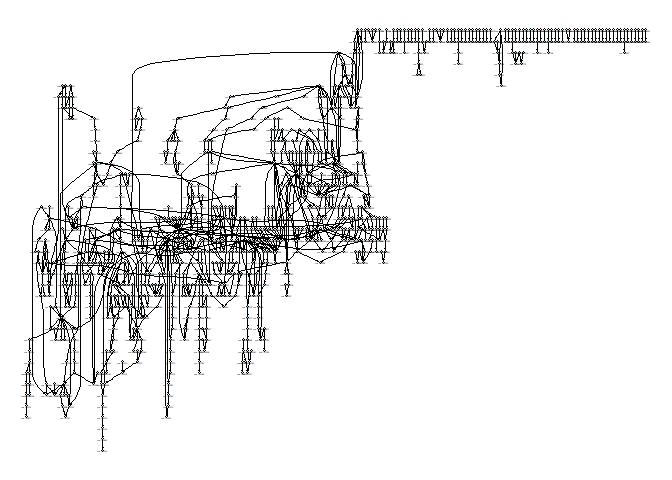<!-- -->

**Fig. 1** The whole reaction network of E.coli. Each node is one
metabolite. Each edge is a reaction. The graph is directed because
reaction has substrates and products.

## Get strongly connected components of thw whole network

To simplify the metabolic network, we need find the strongly connected
components in metabolic network

``` r
G=graph_from_graphnel(chemicalGraph)
members <- membership(clusters(G, mode="strong"))
strongly_connected=lapply(unique(members), function (x) induced.subgraph(G, which(members == x)))
A=strongly_connected[[1]]

S=induced.subgraph(G, which(members==which(table(members)==max(table(members)))|members==which(table(members)==max(table(members))-2)))
plot(igraph.to.graphNEL(S),attrs=list(node=list(fillcolor="red",width=1)))
```

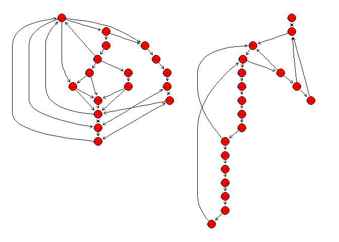<!-- -->

**Fig. 2** The first two largest strongly connected components of the
reaction network. Each node is one metabolite. Each edge is a reaction.
The graph is directed because reaction has substrates and products.

## Annotate the strongly connected components in graph

Below showed that the nodes are annotated with different colors for
different strongly connected components they belong to.

``` r
# plot(G, mark.groups = split(1:vcount(G), members),vertex.label=NA,vertex.size=0.5,edge.arrow.size=0.1,layout= layout.fruchterman.reingold)

# layouts <- grep("^layout_", ls("package:igraph"), value=TRUE)[-1] 
# # Remove layouts that do not apply to our graph.
# layouts <- layouts[!grepl("bipartite|merge|norm|sugiyama|tree", layouts)]
# 
# par(mfrow=c(3,3), mar=c(1,1,1,1))
# for (layout in layouts) {
#   print(layout)
#   l <- do.call(layout, list(G)) 
#   plot(G, edge.arrow.mode=0, layout=l, main=layout) }
# 
# A=plot(igraph.to.graphNEL(S))
# A@agraph

g1 <- layoutGraph(igraph.to.graphNEL(G))
nAttrs <- list()


col_vector = rainbow(length(split(1:numNodes(g1), members)), alpha = 0.3)

my_c=sample(col_vector, length(split(1:numNodes(g1), members)))
for (i in 1:numNodes(g1)){
  nAttrs$fillcolor[nodes(g1)[i]]=my_c[members[nodes(g1)[i]]]
}
names(nAttrs$fillcolor)=nodes(g1)
nAttrs$width=rep(10,numNodes(g1))
names(nAttrs$width)=nodes(g1)

plot(g1,nodeAttrs=nAttrs)
```

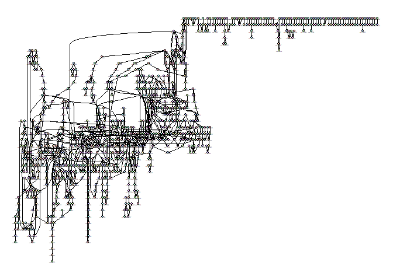<!-- -->

``` r
# plot(graph_from_graphnel(g1),vertex.label=NA, layout=l)

g2=layoutGraph(igraph.to.graphNEL(S))

nAttrs <- list()

for (i in 1:numNodes(g2)){
  nAttrs$fillcolor[nodes(g2)[i]]=my_c[members[nodes(g2)[i]]]
}
names(nAttrs$fillcolor)=nodes(g2)
nAttrs$width=rep(10,numNodes(g2))
names(nAttrs$width)=nodes(g2)
plot(g2,nodeAttrs=nAttrs)
```

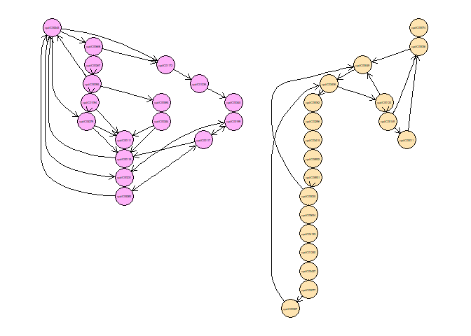<!-- -->

**Fig. 3** Nodes of different strongly connected components are
attributed with different colors.

## Contract several vertices of the same components into a single one

``` r
G_C <- contract(G, members,vertex.attr.comb="first")

g3 <- layoutGraph(igraph.to.graphNEL(G_C))

nAttrs <- list()

for (i in 1:numNodes(g3)){
  nAttrs$fillcolor[nodes(g3)[i]]=my_c[members[nodes(g3)[i]]]
}
names(nAttrs$fillcolor)=nodes(g3)

nAttrs$width=rep(10,numNodes(g3))
names(nAttrs$width)=nodes(g3)
plot(g3,nodeAttrs=nAttrs)
```

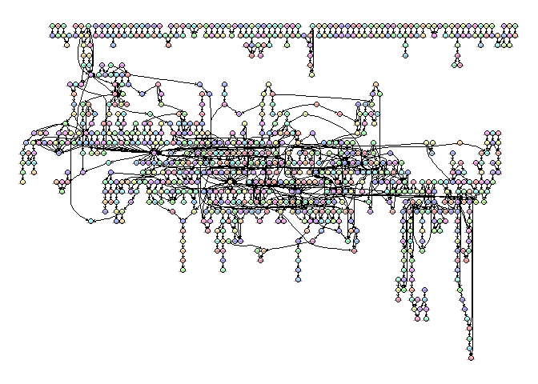<!-- -->

**Fig. 4** The contracted reaction network.

We can see the number of nodes is reduced from 924 to 841

## Seed set and product set of a metabolic network

Next, I want to determine what nutrients should be obtained by microbes
to produce other compounds. In the network, they are the nodes which
only have outdegree, which means these compounds can only be taken up
from environment.These nodes are defined as seed set here. While the
remaining nodes with indegree are the compounds which can be produced by
the seed set.These nodes are defined as product sets.

``` r
Indegree=degree(G_C, v = V(G_C), mode = c("in"),
  loops = TRUE, normalized = FALSE)
Outdegree=degree(G_C, v = V(G_C), mode = c("out"),
  loops = TRUE, normalized = FALSE)
```

### seed set of metabolic network of E.Coli

``` r
names(which(Indegree==0))
```

    ##   [1] "cpd:C02147" "cpd:C00685" "cpd:C06714" "cpd:C02247" "cpd:C03319"
    ##   [6] "cpd:C05847" "cpd:C21994" "cpd:C22068" "cpd:C00173" "cpd:C00423"
    ##  [11] "cpd:C00127" "cpd:C01594" "cpd:C00561" "cpd:C03742" "cpd:C20396"
    ##  [16] "cpd:C00986" "cpd:C00296" "cpd:C00632" "cpd:C11457" "cpd:C05629"
    ##  [21] "cpd:C12621" "cpd:C05607" "cpd:C02265" "cpd:C00582" "cpd:C05332"
    ##  [26] "cpd:C00483" "cpd:C03964" "cpd:C05998" "cpd:C00793" "cpd:C00491"
    ##  [31] "cpd:C01888" "cpd:C00740" "cpd:C00940" "cpd:C02362" "cpd:C02376"
    ##  [36] "cpd:C02354" "cpd:C02355" "cpd:C02067" "cpd:C20254" "cpd:C00881"
    ##  [41] "cpd:C02353" "cpd:C06194" "cpd:C01260" "cpd:C00700" "cpd:C00081"
    ##  [46] "cpd:C00301" "cpd:C00580" "cpd:C11142" "cpd:C00288" "cpd:C01417"
    ##  [51] "cpd:C11537" "cpd:C00565" "cpd:C14180" "cpd:C00672" "cpd:C00121"
    ##  [56] "cpd:C00620" "cpd:C00490" "cpd:C00497" "cpd:C01412" "cpd:C00583"
    ##  [61] "cpd:C04593" "cpd:C02225" "cpd:C01127" "cpd:C00898" "cpd:C01380"
    ##  [66] "cpd:C03451" "cpd:C00937" "cpd:C01177" "cpd:C01204" "cpd:C00270"
    ##  [71] "cpd:C00963" "cpd:C00879" "cpd:C01132" "cpd:C02262" "cpd:C05402"
    ##  [76] "cpd:C05404" "cpd:C00492" "cpd:C00618" "cpd:C11516" "cpd:C00794"
    ##  [81] "cpd:C01487" "cpd:C00392" "cpd:C01019" "cpd:C00507" "cpd:C01934"
    ##  [86] "cpd:C00502" "cpd:C00312" "cpd:C04053" "cpd:C02059" "cpd:C00828"
    ##  [91] "cpd:C15930" "gl:G10610"  "cpd:C02970" "cpd:C00272" "cpd:C01007"
    ##  [96] "cpd:C05791" "cpd:C00853" "cpd:C05766" "cpd:C21284" "cpd:C01935"
    ## [101] "cpd:C01898" "cpd:C16241" "cpd:C05980" "cpd:C02356" "cpd:C00461"
    ## [106] "cpd:C15532" "cpd:C00800" "cpd:C05841" "cpd:C03150" "cpd:C15811"
    ## [111] "cpd:C15810" "cpd:C20247" "cpd:C04294" "cpd:C01279" "cpd:C00378"
    ## [116] "cpd:C00068" "cpd:C00189" "cpd:C00989" "cpd:C16675" "cpd:C20386"
    ## [121] "cpd:C00072" "cpd:C00114" "cpd:C00880" "cpd:C01697" "cpd:C01013"
    ## [126] "cpd:C02612" "cpd:C01847" "cpd:C00053" "cpd:C00818" "cpd:C00243"
    ## [131] "gl:G13040"  "cpd:C03460" "cpd:C06001" "cpd:C00184" "cpd:C00791"
    ## [136] "cpd:C00198" "cpd:C06473" "cpd:C00469" "cpd:C02282" "cpd:C00798"
    ## [141] "cpd:C03089" "cpd:C03546" "cpd:C05730" "cpd:C21028" "cpd:C11638"
    ## [146] "cpd:C07335" "cpd:C02723" "cpd:C02325" "cpd:C00590" "cpd:C02646"
    ## [151] "cpd:C02730" "cpd:C03114" "cpd:C05775" "cpd:C06508" "cpd:C06505"
    ## [156] "cpd:C00430" "cpd:C00473" "cpd:C03479" "cpd:C00568" "cpd:C01063"
    ## [161] "cpd:C00250" "cpd:C00016" "cpd:C16476" "cpd:C02501" "cpd:C04706"
    ## [166] "cpd:C16348" "cpd:C06613" "cpd:C12835" "cpd:C07478" "gl:G00092" 
    ## [171] "cpd:C01290" "cpd:C05892" "cpd:C01212" "cpd:C06397" "cpd:C06251"
    ## [176] "cpd:C04121" "cpd:C04652" "cpd:C00448" "cpd:C16339" "cpd:C16335"
    ## [181] "cpd:C16331" "cpd:C06427" "cpd:C01595" "cpd:C00219" "cpd:C04635"
    ## [186] "cpd:C04317" "cpd:C00641" "cpd:C00350" "cpd:C00093" "cpd:C00245"
    ## [191] "cpd:C05688" "cpd:C00295" "cpd:C02350" "cpd:C11821" "cpd:C00002"
    ## [196] "cpd:C03090" "cpd:C00059" "cpd:C11453" "cpd:C00249" "cpd:C03939"
    ## [201] "cpd:C04618" "cpd:C04620" "cpd:C04619" "cpd:C01209" "cpd:C04633"
    ## [206] "cpd:C05261" "cpd:C04405" "cpd:C00233" "cpd:C04411" "cpd:C02504"
    ## [211] "cpd:C04272" "cpd:C06010" "cpd:C06007" "cpd:C01165" "cpd:C03758"
    ## [216] "cpd:C05577" "cpd:C00082" "cpd:C01267" "cpd:C01157" "cpd:C05946"
    ## [221] "cpd:C00322" "cpd:C04462" "cpd:C00047" "cpd:C05527" "cpd:C00979"
    ## [226] "cpd:C00021" "cpd:C01077" "cpd:C05519" "cpd:C01242" "cpd:C01005"
    ## [231] "cpd:C00152" "cpd:C00246" "cpd:C01213" "cpd:C00163" "cpd:C05668"
    ## [236] "cpd:C00988" "cpd:C00168" "cpd:C04006" "cpd:C00096" "cpd:C00159"
    ## [241] "cpd:C04631" "cpd:C01170" "cpd:C02352" "cpd:C00369" "cpd:C00714"
    ## [246] "cpd:C00333" "cpd:C03033" "cpd:C00259" "cpd:C01101"

There are 249 strongly connected components as the seed set.The ID are
the KEGG accession numbers. The compounds in the strongly connected
components are named by one of the nodes.

### Product set

Then the remained (841-249)=591 components belong to product set

### Plot the seed set and product set in graph

``` r
g3 <- layoutGraph(igraph.to.graphNEL(G_C))

nAttrs <- list()

for (i in 1:numNodes(g3)){
  nAttrs$fillcolor[nodes(g3)[i]]=ifelse(nodes(g3)[i] %in% names(which(Indegree==0)),"red","white")
}
names(nAttrs$fillcolor)=nodes(g3)
plot(g3,nodeAttrs=nAttrs)
```

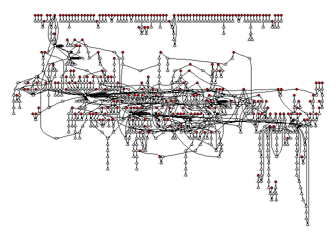<!-- -->

**Fig. 5** The network colored by seed set (red) and product set(white).

## Metabolic competition and complementarity

Using the seed set and product set, we can define metabolic competition
and complementarity indexes.  
The metabolic competition index represents the similarity in two
species’ nutritional profiles. It is calculated as the fraction of
compounds of query species X’s seed set that are also present in the
seed set of a target Y.  
The metabolic complementarity index is calculated as the fraction of
seed compounds of a query species X that are producible by the metabolic
network of a target Y but are not a part of Y’s seed set.

Below is an illustration of the metabolic competition and
complementarity. 

**Fig. 6** The big circle and rectangle represents metabolic network
while small icons represent metabolites which are also the nodes in
network. The edges represent the pathway. The A graph shows the
competition for food (the green and red icons), while B graph shows
complementarity because the left cell provides some metabolites to right
cell.

  - It should be noted that this interaction is not symmetric. For
    example, A may compete with B because 90% of seed set of A is shared
    by B. However, B may only share 50% of seed set with A, so B would
    not competed with A.

Here, I will use two microbial species: E.Coli and Streptomyces
coelicolor as a example and calculate the two indexes for their
metabolic network.

I have shown the network for E.Coli. So I will show the graph of
Streptomyces coelicolor.

``` r
# download kgml file from KEGG site
# url=getKGMLurl("sco01100",organism ="sco")
# download.file(url, "xml/sco01100.xml")

## read the kgml file
mapfile <-  "xml/sco01100.xml"
map <- parseKGML(mapfile)
# map
# reactions <- getReactions(map)

## EXTRACT reaction graph
chemicalGraph <- KEGGpathway2reactionGraph(map)

# outDegrees <- sapply(edges(chemicalGraph), length)
# maxout <- names(sort(outDegrees,decreasing=TRUE))[1:3]

# nAttrs <- list()
# maxoutlabel <- as.list(maxout); names(maxoutlabel) <- maxout
# nAttrs$label <- makeAttr(chemicalGraph, "", maxoutlabel)
# nAttrs$fillcolor <- makeAttr(chemicalGraph, "lightblue", list(orange=maxout))
# nAttrs$width <- makeAttr(chemicalGraph,"0.8", list("1.8"=maxout))
plot(chemicalGraph)
```

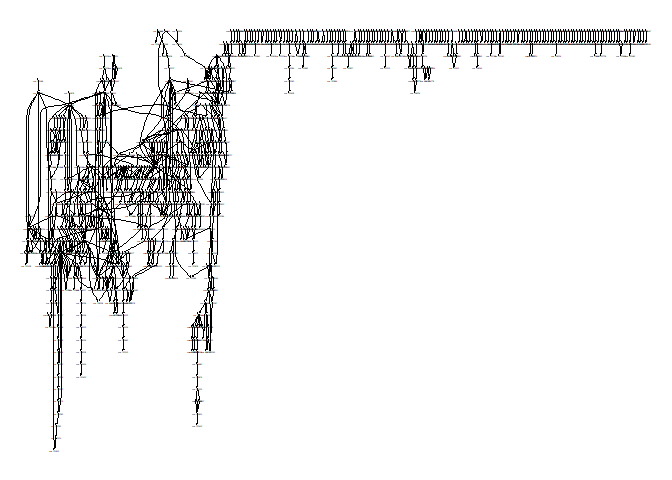<!-- -->

**Fig. 7** The metabolic network of Streptomyces coelicolor.

``` r
members2 <- membership(clusters(graph_from_graphnel(chemicalGraph), mode="strong"))
G_C2 <- contract(graph_from_graphnel(chemicalGraph), members2,vertex.attr.comb="first")
Indegree2=degree(G_C2, v = V(G_C2), mode = c("in"),
  loops = TRUE, normalized = FALSE)
nAttrs=list()


nAttrs <- list()

for (i in 1:numNodes(g3)){
  nAttrs$fillcolor[nodes(g3)[i]]=ifelse(nodes(g3)[i] %in% names(which(Indegree==0)),"red","white")
}
names(nAttrs$fillcolor)=nodes(g3)

nAttrs$width=rep(10,numNodes(g3))
names(nAttrs$width)=nodes(g3)

plot(g3,nodeAttrs=nAttrs)
```

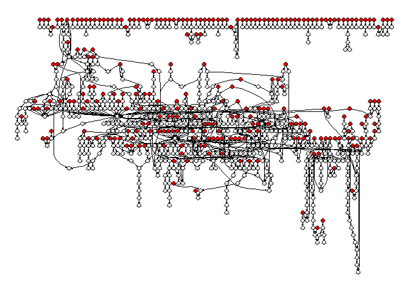<!-- -->

**Fig. 8** The network colored by seed set (red) and product set(white)
of Streptomyces coelicolor.

## The competition index

So we need to see the shared red nodes (i.e. seed set) of two species.

## The shared seed set

``` r
Seed1=names(which(Indegree==0))
Seed2=names(which(Indegree2==0))
Seed=Seed1
for (i in Seed){
  if (length(which(members==members[i]))>1){
    Seed1=c(Seed1,names(which(members==members[i])))
  }
}
Seed1=unique(Seed1)


Seed=Seed2
for (i in Seed){
  if (length(which(members2==members2[i]))>1){
    Seed2=c(Seed2,names(which(members2==members2[i])))
  }
}
Seed2=unique(Seed2)

library(VennDiagram)
 

 
# Chart
venn1=venn.diagram(
  x = list(Seed1,Seed2),
  category.names = c("E.Coli","Streptomyces coelicolor"),
  filename = NULL,cat.pos = c(0,0),main = "seed set",main.cex =2,
  fill=c("red","blue")
)

grid.newpage()
grid.draw(venn1)
```

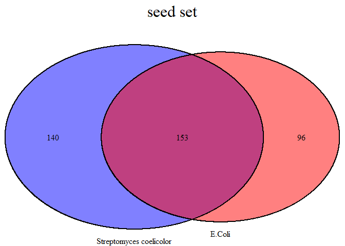<!-- -->

So the competition index for E. coli -\> Streptomyces is
\(153/(96+153)=\) 0.6144578 while the index for Streptomyces -\> E.Coli
is \(140/(140+153)=\) 0.4778157. There values represent how many types
of nutrition they may need in common.

## The complementarity index

There are two directions, too. 1. The product of streptomyces could be
used as seed set of E.Coli; 2.The product of E.Coli could be used as
seed set of Streptomyces.

### shared seed set of E.Coli and product set of Streptomyces

``` r
Seed1=names(which(Indegree==0))
Product2=names(which(Indegree2!=0))
Seed=Seed1
for (i in Seed){
  if (length(which(members==members[i]))>1){
    Seed1=c(Seed1,names(which(members==members[i])))
  }
}
Seed1=unique(Seed1)


Seed=Product2
for (i in Seed){
  if (length(which(members2==members2[i]))>1){
    Product2=c(Product2,names(which(members2==members2[i])))
  }
}
Product2=unique(Product2)

library(VennDiagram)
 

 
# Chart
venn1=venn.diagram(
  x = list(Seed1,Product2),
  category.names = c("E.Coli:seed set","Streptomyces coelicolor: product set"),
  filename = NULL,cat.dist = c(-0.08,-0.08),main = "seed set & product set",main.cex = 2,
  fill=c("red","blue")
)

grid.newpage()
grid.draw(venn1)
```

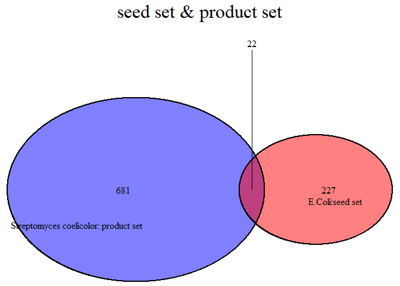<!-- -->

So the complementarity index for Streptomyces -\> E.Coli is
\(22/(22+227)=\) 0.0883534,, which means 0.0883534 of nutrition
requirement of E.Coli could be provided by products of Streptomyces.

### shared seed set of Streptomyces and product set of E.Coli

``` r
Product1=names(which(Indegree!=0))
Seed2=names(which(Indegree2==0))
Seed=Product1
for (i in Seed){
  if (length(which(members==members[i]))>1){
    Product1=c(Product1,names(which(members==members[i])))
  }
}
Product1=unique(Product1)


Seed=Seed2
for (i in Seed){
  if (length(which(members2==members2[i]))>1){
    Seed2=c(Seed2,names(which(members2==members2[i])))
  }
}
Seed2=unique(Seed2)

library(VennDiagram)
 

 
# Chart
venn1=venn.diagram(
  x = list(Product1,Seed2),
  category.names = c("E.Coli:product","Streptomyces coelicolor:seed"),
  filename = NULL,cat.dist = c(-0.08,-0.08),main = "seed set & product set",main.cex = 2,
  fill=c("red","blue")
)

grid.newpage()
grid.draw(venn1)
```

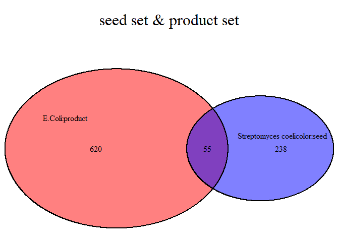<!-- -->

So the complementarity index for E.Coli -\> Streptomyces is
\(55/(55+238)=\) 0.1877133, which means 0.1877133 of nutrition
requirement of Streptomyces could be provided by products of E.Coli.

**So the next step, I will include more species to build a competion
network and a complementary network based on the two indexes.**
